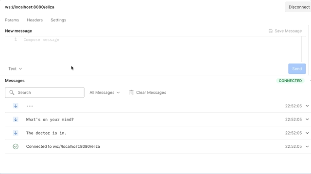

# GUIDE

This is the repository that we will use for the fourth assignment of the course 2022-2023. This guide is command line oriented, but you are free to use IDE like _VS Code_, _IntelliJ IDEA_ and _Eclipse_ which have full support of the tools that we are going to use. We also assume that you have installed in your box at least [Kotlin 1.7.0](https://kotlinlang.org/docs/getting-started.html#install-kotlin).

This laboratory is not a speed competition.

## Preparation

Fork this repository.
Next you will have <https://github.com/UNIZAR-30246-WebEngineering/lab4-websockets> cloned in `https://github.com/your-github-username/lab4-websockets`.

By default, GitHub Actions is disabled for your forked repository.
Go to `https://github.com/your-github-username/lab4-websockets/actions` and enable them.

Next, go to your repository and click in `Code` on the `main` button and create a branch named `work`.

Next, clone locally the repository:

```bash
git clone https://github.com/your-github-username/lab4-websockets
cd lab4-websockets
git branch -a
```

Should show `main`, `work`, `remotes/origin/main` and `remotes/origin/work`.

Then, checkout the `work` branch:

```bash
git checkout -b work
```

Make changes to the files, commit the changes to the history and push the branch up to your forked version.

```bash
git push origin work
```

If you want to run the tests, just run:

```bash
./gradlew test
```

## Primary task

- Complete tests of `ElizaServerTest`

## Historical background

The code implements the script DOCTOR of the [ELIZA](https://en.wikipedia.org/wiki/ELIZA) system and provides you a client and server that communicate each other by means of websockets.
ELIZA is an early example of primitive natural language processing developed by [Joseph Weizenbaum](https://en.wikipedia.org/wiki/Joseph_Weizenbaum) between 1964 and 1966.
ELIZA operated by processing users' responses to scripts, the most famous of which was DOCTOR, a simulation of a [Rogerian psychotherapist](https://en.wikipedia.org/wiki/Person-centered_therapy).
Using almost no information about human thought or emotion, DOCTOR sometimes provided a startlingly human-like interaction.

You can interact with the system using postman at *ws://localhost:8080/eliza*:


*Image created by Jorge Laguna (2021)*


## Steps required

The objective is to complete `ElizaServerTest.kt` by completing the test `onChat` that now is ignored.
The `onChat` test must:

* Send a message from the client to the server that is running a Java implementation of the script DOCTOR.
* Check the client receives a DOCTOR question about your mental health (see examples in `Eliza.kt`).

You must remove `@Ignore` and place up to 6 lines of code to fulfil the task.
`ElizaServerTest.kt` includes the test `onOpen` that will provide you insights.

## How to submit

In your master branch update your corresponding row in README.md with the link to your work branch, the GitHub actions badge for CI and a link to a document that proof or explains how you solved this lab.

Do a pull request from your `main` branch to this repo main branch.
The only file modified in the pull request must be `README.md`
The pull request will be accepted if:

- Your `work` branch contains proofs that shows that you have fulfilled the primary tasks.
- In `README.md` you provides a link to your work branch in your repository, i.e.:

  ```md
  [your-github-user-name](https://github.com/your-github-username/lab4-websockets/tree/work)
  ```

  along with your NIA and a link to your CI workflow.

  ```md
  ](https://github.com/your-github-username/lab4-websockets/actions/workflows/ci.yml)  
  ```

  and the color of your CI workflow triggered by a push event in the branch named work is green.
